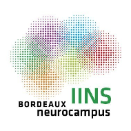

# Nucleus Feature Extraction

Extract [3D image features](https://pyradiomics.readthedocs.io/en/latest/features.html) from nuclei using segmentations obtained with [StarDist](https://github.com/stardist/stardist).
